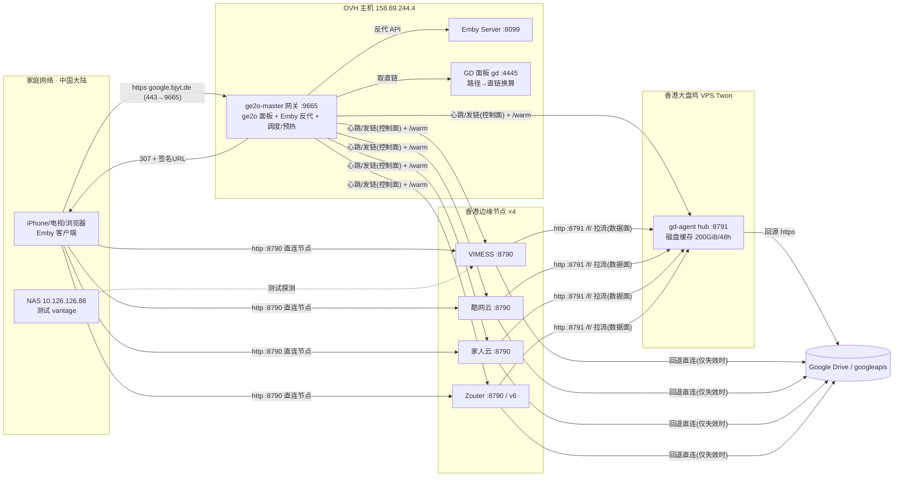
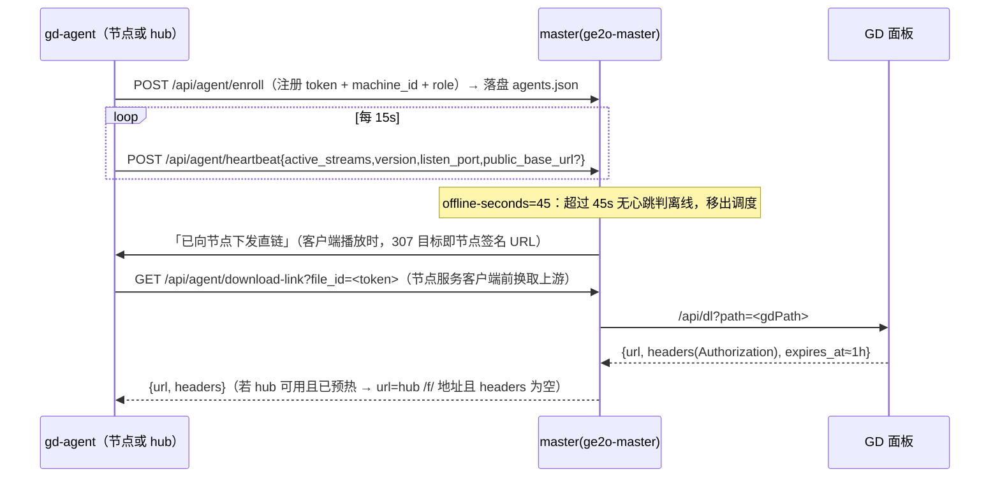
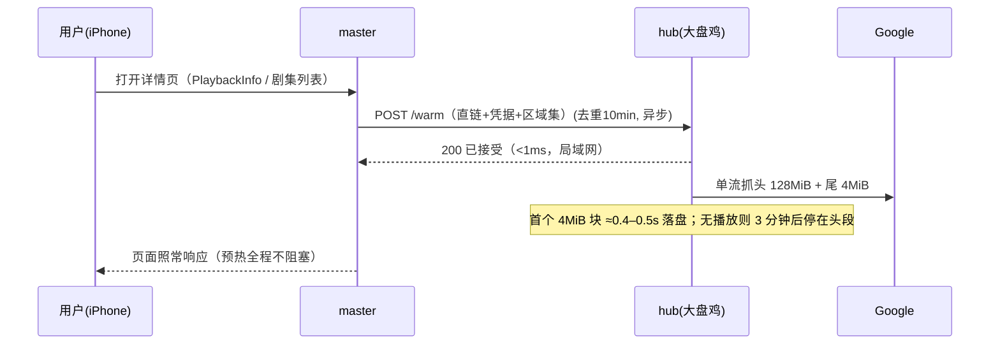
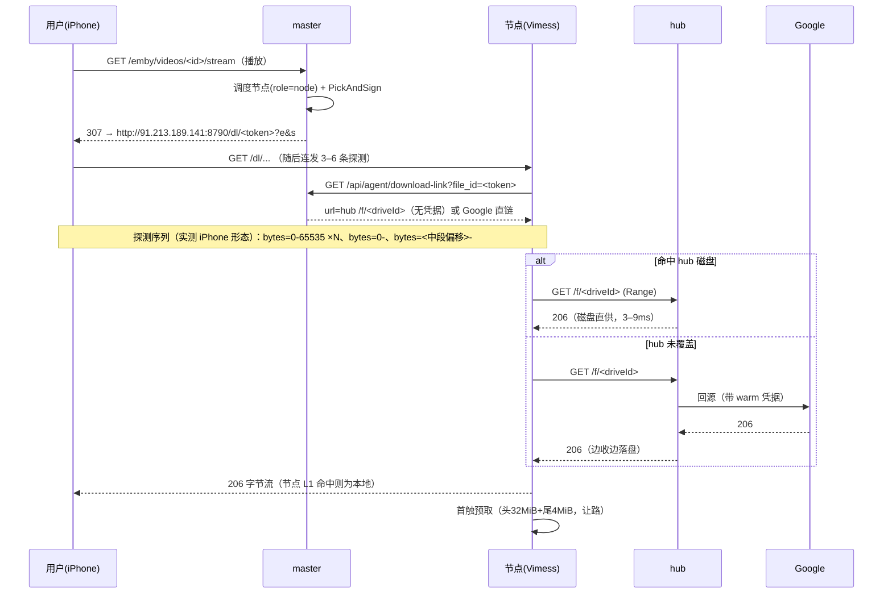
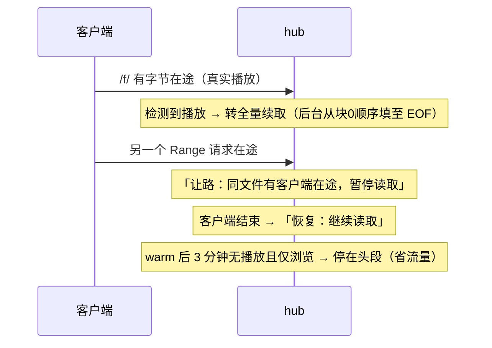
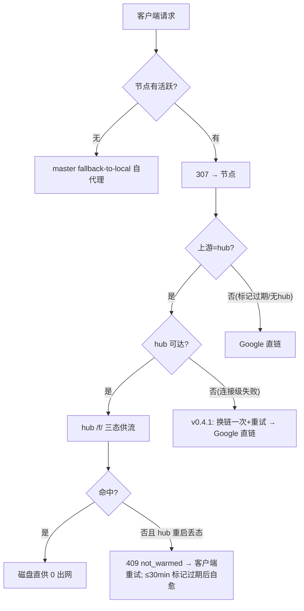

# 家庭媒体系统 · 全貌交底文档（面向可视化）

> **用途**：本文档交付给另一个 AI，用于对整个项目做可视化（架构图 / 数据流动画 / 时序图 / 状态机 / 性能面板等）。
> **文档基准日**：2026-10-10；系统版本：网关自定义版（基于 go-emby2openlist），agent 网络 v0.4.1 全量上线。
> **保密说明**：本文档**不含任何密钥/令牌/签名值**，仅含"密钥在哪个文件里"的位置说明。真实内网/公网地址已按实际填写（均为项目自有基础设施）。

---

## 0. 阅读指引（给可视化 AI）

系统分三个层级可画，建议产出以下图集：

| # | 图 | 数据来源章节 | 建议形式 |
|---|---|---|---|
| 1 | 部署拓扑图 | §3 | 静态图（可选交互：点组件看详情） |
| 2 | 播放主链路时序（浏览→预热→播放→探测→拉流） | §6.1/§6.2 | 时序动画（可用 mermaid sequenceDiagram 起步） |
| 3 | 三级缓存数据流（客户端→节点→大盘鸡→Google） | §5 | 数据流动画（沿链路流动粒子表示字节） |
| 4 | 故障回退路径（大盘鸡挂 / 节点挂 / 无节点） | §6.5 | 分支高亮动画 |
| 5 | 缓存文件状态机（未缓存→预热中→部分→全量→过期/淘汰） | §7 | 状态机图 |
| 6 | 控制面心跳/注册/调度关系 | §4 | 图 + 时间轴 |
| 7 | 版本与上线时间线（v0.3.1→v0.4.1 各能力） | §8 | 时间线 |
| 8 | 性能数字标注（TTFB/填速/带宽矩阵叠在链路上） | §10 | 标注层叠在拓扑/链路上 |

关键概念：**控制面**（master↔agent，心跳/发链，KB 级）与**数据面**（客户端→节点→大盘鸡→Google，MB~GB 级）严格分离——可视化建议把两者分开或做开关切换。

---

## 1. 一句话与目标

把存放在 **Google Drive** 里的影视库，通过 **Emby** 呈现给中国大陆家庭网络中的 iPhone/电视等客户端；用一组**境外边缘节点 + 一台香港"大盘鸡"缓存中心**解决两个核心问题：
1. **中国大陆直连 Google 被墙**（家庭宽带 8/8 Google IP 全断）→ 媒体流量必须经过境外节点；
2. **每次起播慢**（Google 每请求 ~0.5–1s 固有初始化 × 播放器 3–6 个启动探测 + 链路 RTT）→ 用两级缓存把"起播探测"全部变成"本地磁盘命中"。

---

## 2. 角色与组件清单

| ID | 组件 | 位置/地址 | 软件 | 端口 | 职责 |
|---|---|---|---|---|---|
| C1 | 客户端 | 家庭网络（iPhone「Lenna」应用、浏览器、电视） | Emby 客户端 | — | 浏览海报墙、发起播放、发探测请求 |
| C2 | **master 网关** | OVH 主机 `158.69.244.4`（docker 容器 `ge2o-master`，镜像 `ge2o:master` 由源码构建） | 本项目（go-emby2openlist 自定义版，Go） | 外 9665 → 容器 8095；外部域名 `google.bjyt.de`（443 前置反代，细节未核） | Emby API 反代与补丁、播放重定向(307)、agent 调度、预热、hub 接入、web 管理面板(ge2o)、`/install.sh` 下发 |
| C3 | **真实 Emby 服务器** | 同一台 OVH 主机（容器 `gmby_server`） | Emby Server 4.10 | 宿主 8099（容器视角 `172.17.0.1:8099`） | 媒体库元数据、播放会话（媒体实体在 Google Drive，经 strm 挂载） |
| C4 | **GD 管理面板** | 同一台 OVH 主机（容器 `gd`） | 自研面板（Python） | 127.0.0.1:4445；外部 `https://gd.bjyt.de` | 把「Drive 路径」换成「Google 直链 + Authorization」，响应毫秒级、不转发字节 |
| C5 | **Google Drive** | `www.googleapis.com`（`/drive/v3/files/<id>?alt=media`） | — | 443 | 媒体字节的真实来源；直链 Authorization 约 1 小时寿命 |
| C6 | **边缘节点 ×4**（role=node） | VIMESS `91.213.189.141`；酷网云 `156.239.13.139`；家人云 `216.23.95.27`；Zouter `155.117.82.69`（对外 v6：`http://[2a0e:97c0:3f0:1::1b01]:8790`） | `gd-agent` v0.4.1（systemd 服务 `gd-agent`） | 8790（公开，签名 URL） | 面向客户端：relay 拉流、内存 L1 缓存、首触预取（头 32MiB+尾 4MiB）、让路、断点续取 |
| C7 | **大盘鸡缓存中心**（role=hub） | VPS.Twon `154.19.43.32`（250G 数据盘挂 `/home`） | `gd-agent` v0.4.1（ROLE=hub） | 8791（白名单：master + 四节点 IP） | 全网唯一回源点：磁盘 L2 缓存（200GiB 预算、48h TTL）、`/f/` 供流、`/warm` 预热、全量渐进填充 |
| C8 | 运维/测试辅助 | NAS `10.126.126.88`（家庭 vantage，经 OneSSH）；OneSSH 网关（OVH 主机 8866）；腾讯云节点（国内跳板） | — | — | 真链测速 vantage（"家庭视角"）、远程管理通道 |

**数据流一句话**：`C1 → C2(307) → C6 → C7 → C5`（控制面/直链换取另经 C2→C4）。

### 2.1 master 网关的功能面（config.yml 分区视角）

master 除了 agent 网络之外，本身是一个 Emby 前端网关，可视化时可以做成"网关内部的模块图"：

| 配置分区 | 作用 |
|---|---|
| `emby` | 反代真实 Emby；`strm.path-map` 路径片段映射（如 `/home/googleDrive => <直链域名>`）；`internal-redirect-enable`（strm 内部重定向）；`preheat-enable`（浏览预热开关）；`download-strategy`；`local-media-roots`（本地媒体根，命中则走本地代理）；`images-quality`；`custom-css-js` |
| `gdrive` | GD 面板直链接入：`api-base`、`api-token`、`mount-prefix=/home/googleDrive` —— 节点直链网络的数据源 |
| `agent-network` | 节点注册/调度/预热/hub 接入（详见 §4、§5.4、§5.5） |
| `path.emby2openlist` | Emby 挂载路径 ↔ 真实网盘路径的前缀映射 |
| `cache` | 响应缓存中间件：默认 1d；直链接口固定 10m、字幕接口 30d |
| `openlist` | 历史功能（网盘 openlist 接入 + 本地目录树生成：虚拟/strm/音乐容器、扫描前缀）；当前主导航已以 gdrive 直链为主 |
| `video-preview` | 转码资源信息获取（默认关闭） |
| `ssl` / `log` | 传输层与日志开关（彩色日志等） |

网关内部关键代码路径（供"实现级"可视化参考）：
- 播放接线：`internal/service/emby/redirect.go`（strm 分支 → `PickAndSign`）
- 预热：`internal/service/emby/preheat.go`（`TransferPlaybackInfo` / `LoadCacheItems` 触发 → `WarmFile`）
- agent 网络：`internal/service/agentnet/`（`hub.go`：选择函数/`/warm` 下发/上游改写；`api.go`：enroll/心跳/download-link；`schedule.go`：调度；`installshell/agent-install.sh`：一键安装）
- 直链：`internal/service/gdrive/`（面板 `/api/dl` 封装与缓存）

---

## 3. 网络与部署拓扑



**链路实测（2026-10-10）**：

| 链路 | RTT | 带宽（实拉 256MB） |
|---|---|---|
| 四节点 ↔ 大盘鸡 | 0.7–2.3 ms（近内网） | **36–118 MB/s / 台**；四台并发 ≥274MB/s |
| 四节点 ↔ OVH(master) | 231 ms | 2.2–7.7 MB/s / 台；四台并发 ~20MB/s |
| 家庭 NAS ↔ 节点 | ~0.15–0.2 s | 正常宽带 |
| 家庭 ↔ Google 直连 | — | **全部不通（被墙）** |
| 家庭 ↔ 大盘鸡 | 210 ms（高负载期） | - |
| 节点 ↔ googleapis | 1–2 ms | 四节点 8/8 IP 全通 |
| 大盘鸡 ↔ googleapis | 1 ms（好 IP） | 6/8 IP 通；2 个坏 IP（详见 §11） |

---

## 4. 控制面协议（master ↔ agent）



**要点：**
- **注册**：一次性 enroll（`gd-agent enroll --master … --token … [--role node|hub] [--public-url …] [--port …]`），凭据落 `/etc/gd-agent/config.env`（0600，服务用户 `gd-agent`）。
- **签名客户端 URL（冻结格式）**：
  `http://<节点>:8790/dl/<token>?e=<unix秒>&s=<hex>`；`s = HMAC-SHA256(sign_key, "v1\n<token>\n<e>")`；每 agent 独立 `sign_key`（64 位 hex）；`token = base64url(gdPath)`（无填充）。默认 TTL 24h。
- **注册表**：master 内存热态 + `/dpanel/compose/ge2o-master/agent-network/agents.json`（只在注册/管理编辑时写盘）。实时查询：`POST http://127.0.0.1:9665/ge2o/agent-network/agents`，body `{"secret": <ge2o.api-secret>}`。
- **角色**：`role=node`（面向客户端）| `role=hub`（永不参与客户端调度，见 §5.3）。注册表含 `last_ip/version/priority/public_base_url/role`。
- **调度**：客户端播放由 master 选节点——候选只含 `role=node`，按优先级升序（数字越小越优先，0=最高）＋活跃流数。hub 永不被选中。
- **配置（master，`config.yml` 的 `agent-network` 节）**：`enable`、`enroll-token`、`offline-seconds:45`、`url-ttl:24h`、`fallback-to-local:true`、`hub-enable:true`、`hub-port:8791`、`hub-warm-timeout:3s`。

---

## 5. 数据面：三级缓存

### 5.1 总览

```
客户端 ──直连──▶ 边缘节点(内存 L1：头32MiB+尾4MiB/文件，256MB LRU，TTL 24h)
                     │ 未命中区段
                     ▼
              大盘鸡 hub(磁盘 L2：全文件渐进缓存，200GiB LRU，TTL 48h)
                     │ 未命中
                     ▼
                 Google Drive
```

### 5.2 节点服务（`/dl/<token>`，GET only）

- **三态服务**：
  - **满命中**：所请求区段完整落在有效缓存块里 → 纯本地供流（**零出网、零凭据**）；
  - **部分命中**：先生成本地前缀直接写给客户端并 flush（"前缀先行"，TTFB 不含等上游的时间），再从上游续传余段；
  - **未命中**：纯透传上游，同时**路过即存**（凑满 4MiB 块即落）。
- **首触预取**（v0.3.2 冻结语义）：某文件首次被请求 → 后台单条大流 `Range: 0-(32MiB-1)` 流式切片落块（首个 4MiB 块约 0.5s 就绪）＋尾部一条独立 Range；全量=**2 条上游请求**（旧实现 10 条）。
- **让路**：同文件有客户端请求在途时预取暂停（500ms 轮询），结束自动恢复。
- **断点续取**：流中断后只补缺失块；不完整块永不入缓存。
- **缓存标识（identity 链）**：`ETag → Last-Modified → size:<字节数>`（真实 Google 响应只有最后一项）；TTL 1440 分钟。

### 5.3 hub 服务（`/f/<driveFileID>`、`/warm`、`/cancel`，仅白名单 IP）

- **`/f/` 三态**：与节点同语义；命中**不需要直链**（纯磁盘供流）；未持直链且未缓存 → `409 {"error":"not_warmed"}`。
- **`POST /warm` 载荷**：`{file_id(Drive id), file_token(base64url gdPath，供 hub 换链), direct_link, auth, regions{head_bytes=128MiB, tail_bytes=4MiB, resume_offset_bytes?}}`；**200=接受**；重复 warm=200 并采纳新直链。hub 用它走 master 的 download-link 通道换新链（直链 ~1h 过期后的自愈路径）。
- **3 分钟规则**：warm 后无真实播放 → 抓完头段即停；检测到 `/f/` 有客户端在途 → 转"全量续取"（后台渐进填完整文件，让路照旧）。
- **出站加固**：多地址快速失败拨号（每 IP 1.5s，末位 4×宽限）；本机实测 googleapis 6/8 IP 可用（§11）。
- **白名单**：`HUB_ALLOW_IPS` = master + 四节点（fail-closed，空名单=全拒）。监听 8791。
- **磁盘布局**：`/home/ge2o-hub-cache/<hash前2位>/<hash>/{meta.json, <idx>.blk}`（4MiB/块，temp+rename 原子写）；48h 惰性 TTL + 10 分钟清扫；200GiB LRU 硬上限。**单实例约束**（无跨进程锁）。
- **凭据流向**：节点→hub 不带 Authorization；hub→Google 带 warm 时收到的 Authorization。

### 5.4 master 的播放接线（唯一集成点）

客户端播放 → 网关 `redirect.go`（strm 分支）→ `PickAndSign`：
- 正常：302/307 到节点签名 URL；节点服务时向 master 换 `download-link`；
- **hub 路径**：若该文件已有有效 warm 接受标记 → master 在 download-link 响应里把上游改写为 `http://154.19.43.32:8791/f/<driveFileID>`（不带凭据）；否则回 Google 直链；
- 无在线节点时 `fallback-to-local`：由网关自己代理回源（保底可用）。

### 5.5 预热（master → hub）

- 触发点：Emby 详情页 `PlaybackInfo`、剧集列表 `LoadCacheItems`（浏览即触发）；同一路径 10 分钟去重；全程异步（实测握手 ~500ms，不阻塞浏览）。
- 载荷区域：头 128MiB + 尾 4MiB（续播点字段目前恒不发）。
- 接受标记 TTL 30 分钟（< 直链 1h，自然自愈）；失败 30s 冷却；无健康 hub 时零额外开销（不请示面板）。

---

## 6. 核心时序

### 6.1 浏览 → 预热（当前最优路径）



### 6.2 播放主链路（含探测）



**端到端实测（家庭 NAS 视角）**：全链热探测 TTFB **0.36–0.38s**（= 家庭到香港的网络地板）；冷探测 2.6s（面板解析 + Google 初始化）；节点从 hub 取块 3–9ms。

### 6.3 全量续取 / 让路 / 停止



### 6.4 故障与回退



- **连接级失败**（refused/DNS/RST）→ 恰好 1 次换链 + 1 次重试（v0.4.1；超时不触发）；
- **hub 停机 drill 实测**：停 hub → 未缓存区段 TTFB 2.6–3.0s 的 206（修复前为 502）；
- **后缀区间 `bytes=-N`**：hub 按 size 解析后缓存供流（v0.4.1；此前会绕上游卡 30s）。

---

## 7. 缓存状态机（单个文件，节点/hub 通用）

```mermaid
stateDiagram-v2
  [*] --> 未缓存
  未缓存 --> 首块就绪: 首触/warm（单流切片，~0.5s）
  首块就绪 --> 头段完整: 连续填充（头 32MiB[节点]/128MiB[hub]）
  头段完整 --> 尾段完整: 尾部对齐窗 Range
  尾段完整 --> 全量: 检测到真实播放 → 后台续全量
  全量 --> 过期: TTL（节点24h/hub48h）惰性判过期
  全量 --> 淘汰: LRU 超预算（节点256MB/hub 200GiB）
  过期 --> [*]
  淘汰 --> [*]
  note right of 尾部对齐窗
    尾部窗起点按 4MiB 块对齐下取整；
    文件末块允许不足 4MiB。
  end note
```

---

## 8. 发布与升级流水线（现状）

```
源码（本机 /home/debian/project/go-emby2openlist，只留本机）
  →（git 快照同步到发布 fork yating1022/go-emby2gd）
  → push tag agent-v<X.Y.Z>
  → GitHub Actions：go vet + go test -race 质量门 → 交叉编译 linux/amd64+arm64（注入版本号）→ gh release create（三件套资产）
  → 节点升级：curl -fsSL http://158.69.244.4:9665/install.sh | bash
     安装器从 https://github.com/yating1022/go-emby2gd/releases/latest/download/ 下载
     幂等路径=只换二进制+重启（不重新注册、凭据不轮换）；--public-url 就地更新；--role hub 支持 hub 注册
  → master 升级：sudo docker build -t ge2o:master <源码目录>；cd /dpanel/compose/ge2o-master && sudo docker compose up -d --force-recreate
```

**版本时间线**：

| 版本 | 日期 | 关键能力 |
|---|---|---|
| v0.3.1 | 2026-10-09/10 | agent 读前缓存（头32MiB+尾4MiB）；网关预热；混合服务"前缀先行"；IPv6 客户端接入（Zouter v6）；优先级调度 |
| v0.3.2 | 2026-10-10 | 预取单流切片（上游请求 9→2，首块 ~0.5s）；让路；断点续取；网关预热告警分级 |
| v0.4.0 | 2026-10-10 | **hub 模式**（大盘鸡缓存中心全套：磁盘缓存/`/f/`/`/warm`/白名单）；master 接入（role/调度隔离/预热改向/上游改写/回退）；安装器 `--role` |
| v0.4.1 | 2026-10-10 | 节点连接级失败→换链重试（hub 停机自动回退）；hub 后缀区间解析（`bytes=-N` 缓存供流） |
| 观察项 | — | hub 48h TTL/LRU 生效曲线；Twon 月流量（3T 配额）；3 分钟规则的真实浏览场景 |

---

## 9. 运维视角速查

| 项 | 位置 |
|---|---|
| master 配置 | `/dpanel/compose/ge2o-master/config.yml`（root 0600，`sudo` 读） |
| 注册表热态 | `POST http://127.0.0.1:9665/ge2o/agent-network/agents`，body `{"secret": <ge2o.api-secret>}` |
| 注册表落盘 | `/dpanel/compose/ge2o-master/agent-network/agents.json`（密钥在此，勿外传） |
| 节点配置 | `/etc/gd-agent/config.env`（0600，`gd-agent:gd-agent`）；hub 在 Twon 同路径 |
| hub 缓存盘 | `/home/ge2o-hub-cache`（Twon vdb1 250G 盘；`systemd` 单元含 `RequiresMountsFor=/home`） |
| 日志 | master：`sudo docker logs ge2o-master`；节点/ hub：`journalctl -u gd-agent -f` |
| 远程管理 | OneSSH 网关（OVH:8866）；主机别名：VIMESS / 酷网云 / 家人云 / Zouter / VPS.Twon / NAS / OVH / 腾讯云 等 |
| 常见操作 | 节点升级=安装器幂等重跑；hub 升级后需回补 systemd 单元的 `RequiresMountsFor=/home`（安装脚本会按模板重写单元） |
| 安全门 | 节点 `sign_key`（HMAC）；hub 白名单 fail-closed；master 管理接口 secret；直链凭据仅内存流转、永不落日志 |

---

## 10. 性能与实测数据（可视化可做"数字标注层"）

| 指标 | 数值 | 场景 |
|---|---|---|
| 起播探测 TTFB（热） | 0.36–0.38 s | 家庭 NAS → 节点 → hub 磁盘 |
| 起播探测 TTFB（冷） | 2.6 s | 面板解析 + Google 初始化（一生一次） |
| 首触预取上游请求数 | **2**（头单流+尾） | 旧实现 ~10 |
| 首块就绪 | 节点 ~0.5s；hub ~0.44–0.51s | 4MiB 落盘 |
| 节点←hub 取块 | 3–9 ms | 缓存命中 |
| hub 填充速度 | ~9 MB/s | Twon→Google（好 IP 时） |
| 节点←Twon 带宽 | 36–118 MB/s/台 | 近内网 |
| 节点←OVH 带宽 | 2.2–7.7 MB/s/台 | 231ms RTT 单流受限 |
| 大盘鸡↔四节点 RTT | 0.7–2.3 ms | — |
| hub 白名单拒绝 | 403（fail-closed） | 非白名单 IP |
| 回退（hub 停机） | 2.6–3.0 s 后 206 | 连接失败换链 |
| 预热握手 | ~500 ms（含异步）、接受 <1ms | master→hub |

---

## 11. 已知问题与设计窗口（可视化可做"状态徽标"）

| 项 | 状态 | 说明 |
|---|---|---|
| 大盘鸡遭 DDoS | 🔴 进行中 | 表现为：家庭侧 210ms/丢包、2/8 Google IP 黑洞/秒拒、填速波动；用户方后续修复。系统已具备带病运行能力（多地址快速失败拨号 + 换链回退） |
| hub 重启窗口（R1） | 🟡 设计内 | 重启后 ≤30min：未缓存区段 409 `not_warmed` 直达客户端，标记过期后自愈；修法备忘=心跳 `uptime_seconds` 检测重启作废标记 |
| hub 单实例约束 | 🟡 约束 | 无跨进程锁，同一缓存目录只允许一个 hub 进程（systemd 单实例） |
| 后缀区间 | 🟢 已修 | hub 按 size 展开缓存供流（v0.4.1） |
| 同尺寸文件替换 | 🟡 兜底 | identity=size:N 场景靠 48h/24h TTL 兜底 |
| 观察项 | ⚪ | 48h TTL/LRU 实际淘汰曲线、月流量（3T 配额）、真实浏览下的 3 分钟规则 |

---

## 12. 术语表

| 术语 | 含义 |
|---|---|
| master | OVH 上的网关（本项目），控制面中心 |
| 节点 / agent | 香港边缘 gd-agent（role=node），面向客户端 |
| 大盘鸡 / hub | VPS.Twon 上的 gd-agent（role=hub），唯一回源点+磁盘缓存中心 |
| 直链 | GD 面板换出的 Google 下载地址 + Authorization（约 1h 寿命） |
| 签名 URL | 节点数据面入口 `/dl/<token>?e&s`（HMAC v1） |
| 预热 / warm | 浏览时提前让 hub（或节点）抓取文件的探测区域 |
| 探测序列 | 播放器启动时连发的 3–6 个 Range 请求（头/尾/中段偏移） |
| 让路 | 预取流为在途客户端请求暂停，结束后自动恢复 |
| 前缀先行 | 部分命中时先写本地前缀再续上游（v0.3.1） |
| 三态服务 | 满命中/部分命中/未命中的三种服务形态 |
| R1 窗口 | hub 重启后的 ≤30 分钟陈旧指向窗口 |
| L1 / L2 | 节点内存缓存 / hub 磁盘缓存 |

---

## 13. 给可视化 AI 的补充建议

1. **两级平面**：控制面（细线、KB 级、心跳脉冲动画）与数据面（粗线、MB/s 流动）分开；数据面沿 `客户端→节点→hub→Google` 方向做粒子流。
2. **三种"温度"**：同一文件三种状态（未缓存：灰色链路直通 Google；预热中：hub 侧点亮+渐进填充进度条；全热：节点→hub 段高亮、Google 段熄灭）——这是整个系统最核心的视觉叙事。
3. **数字标注**：§10 表格直接叠到对应链路上（TTFB/带宽/RTT）。
4. **动态数据源**（若要"活"的图）：注册表 `POST /ge2o/agent-network/agents`（节点在线/版本/活跃流）；hub 与节点 `journalctl` 日志（预热/命中/让路事件流）；hub 磁盘目录（缓存占用）。
5. **交互细节建议**：点击节点展开其缓存清单（内存 L1 头尾块示意）；点击链路展示协议（HMAC/307/心跳字段）；时间轴模式下可播放 §6 的时序动画。
6. **配色建议**：master=蓝、节点=绿、hub=紫、Google=灰、客户端=橙；故障态=红（DDoS/409/回退中）。
